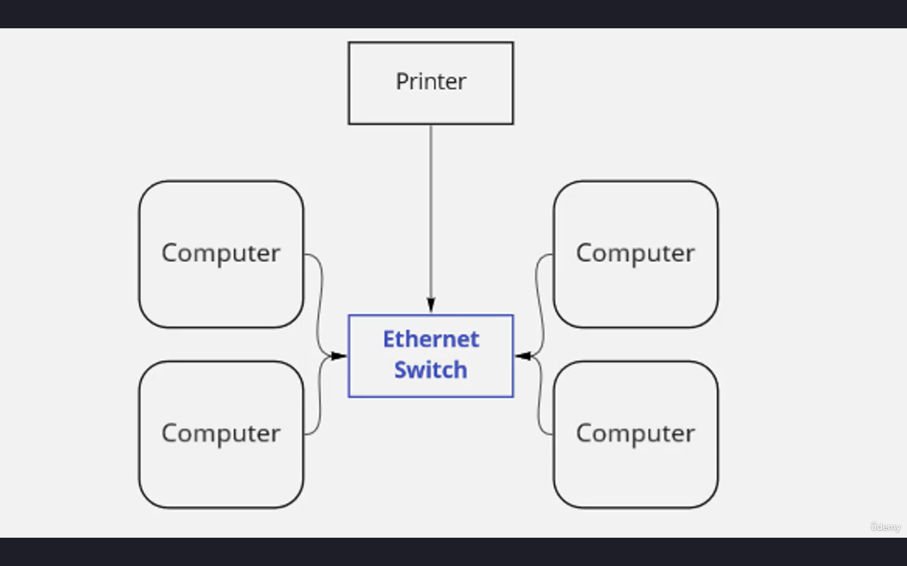
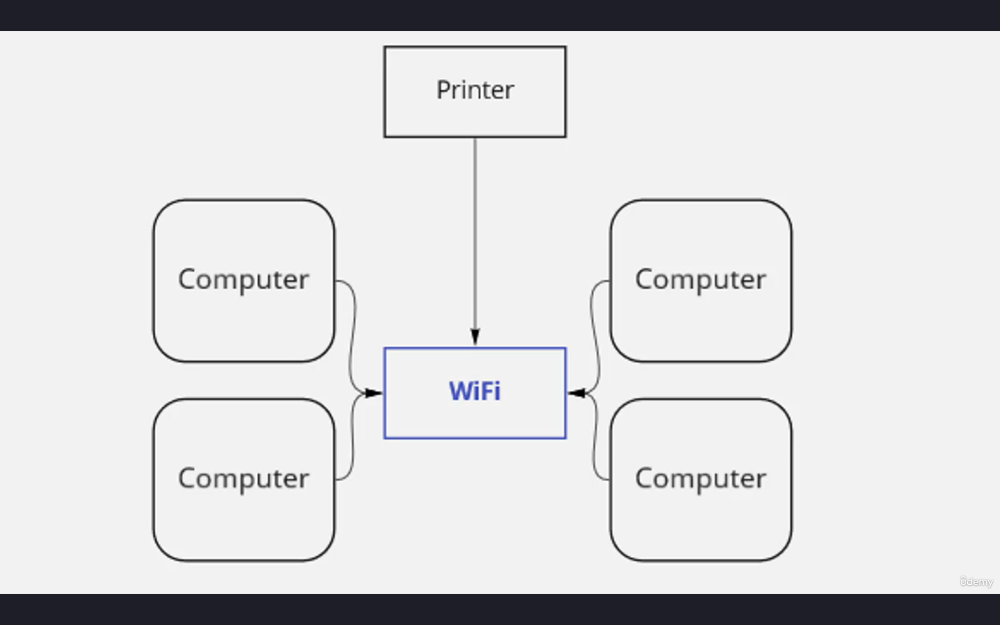
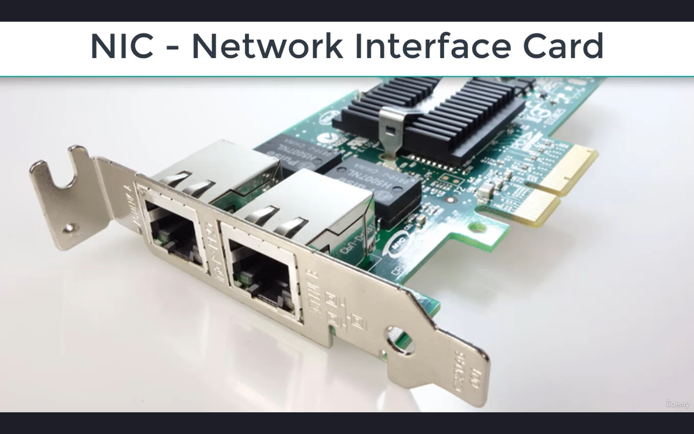
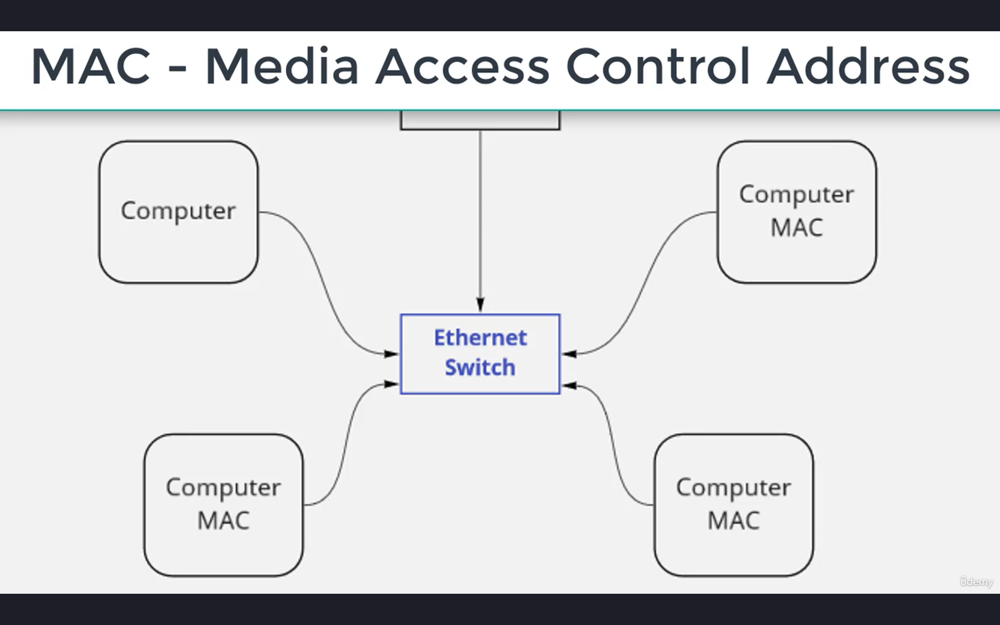
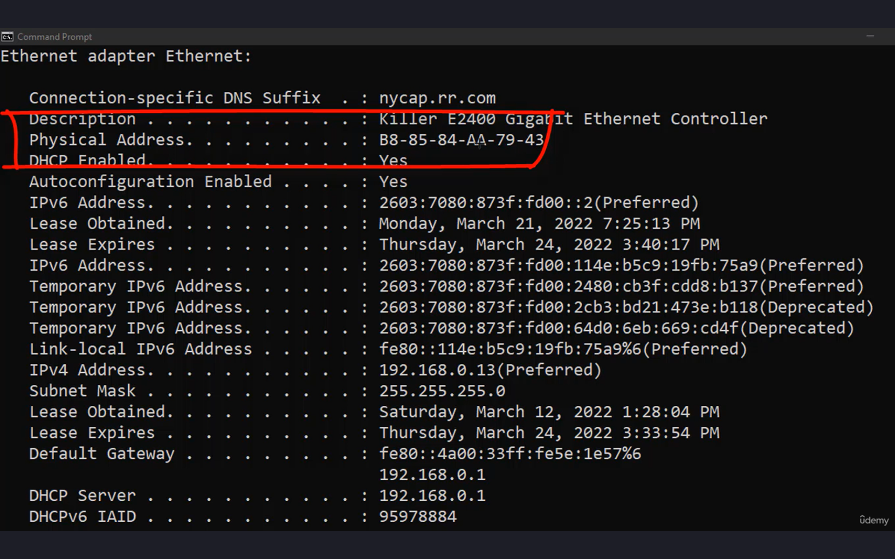
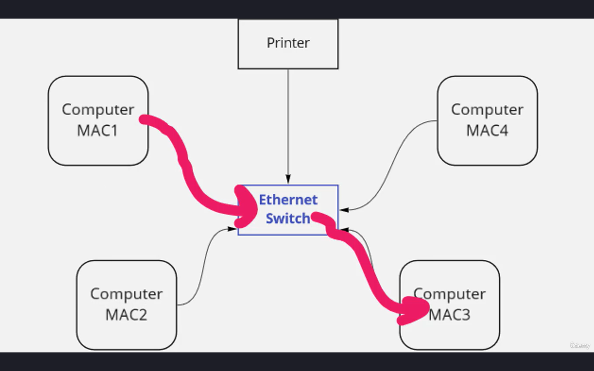
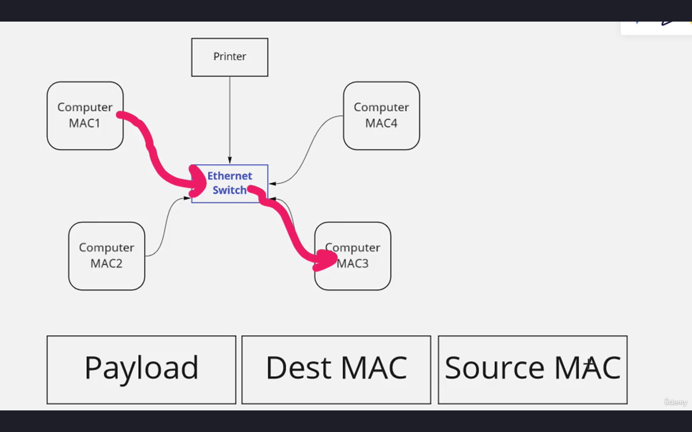
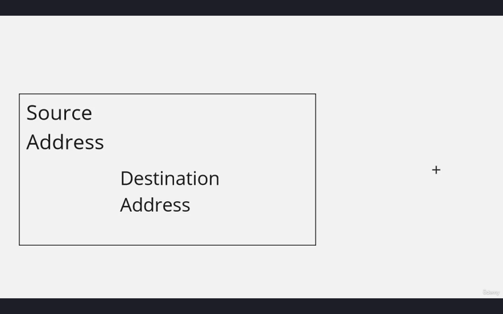
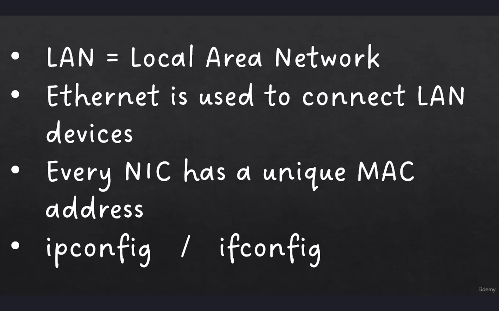

# Local Area Network (LAN):

- Let's imagine a very simple and very basic network where we have a few computers, and these computers are all going to need the ability to communicate with one another.
- And not only do we have computers that are going to be connected, but we may also have printers as well.
- We're going to need to utilize something that can connect all of these devices together.
- And one of those devices that we could use to connect all of these components is called
an ethernet switch.
- So this is a physical network device with a bunch of ports on it.
- Basically, we can take cables from all of these computers, ethernet cables, and we can connect all of these computers up to this switch and allow them to communicate with one another as well as potentially connecting other devices like printers.
- The OSI model is just a handy way to kind of keep networking components organized in your mind.
- And what we're looking at here from a layer one perspective is how are these devices physically connected?
- They have these cables that you're using is ethernet.
- So we are connecting these cables to this physical switch.

- And it doesn't necessarily have to be old fashioned physical networking like this.
- This could be a Wi-Fi access point, and we could have wireless connections connecting all of these devices together.
- The purpose of this local area network, is to take these devices that are in the same physical location and connect them all to one another.

- And so what we'll do is we'll take a network cable and we'll plug it into a network interface card on our computers.
- Now this is a network interface card, and these are the kind that we used to install
on our physical PCs.
- Nowadays, for the most part, the network card is built right in, and you don't actually have to install one, it's just built right into the motherboard.
- But either way, you're going to have a physical port on your network card on your computer that looks something like this.
- And so we'll take a wire and we'll plug it into this.
- The other end of that wire is going to go into a switch, an ethernet switch.
- So now we have many devices connected to this ethernet switch. This is what we call a star topology.
- And what I mean by a star topology is the switch is kind of at the center of this star and it's connecting everything to one another. That's a star topology.
- We've got this switch kind of in the middle of the picture, connecting all of these devices to one another.

- And every one of these computers has a network interface card.
- And every one of those network interface cards has a unique MAC address, a Media Access Control address.
- So when these hardware manufacturers build this hardware, and they do things like create network interface cards, for each of these interfaces that you see here, they actually hard code an address in, they hard code a unique identifier associated with this particular port.
- If your computer only has one ethernet port,
it's only gonna have one MAC address. That MAC address is permanent and it's associated with that physical adapter, and we can actually see those on our computer.
- So let's launch command prompt on my computer and let's type in the command ipconfig /all.
- And that ipconfig /all is going to return all kinds of information about my different network adapters, including things like IP addresses and other information as well.

- Notice that it has a physical address. This is the MAC address of the physical ethernet adapter on my computer.
- If you're on a Mac or a Linux machine, you can use the ifconfig command, basically the same thing.
- Every single network adapter, every single ethernet adapter in the world has a unique MAC address.
- And so now let's go back to our little network diagram here. And let's imagine that these computers want to communicate with each other.

- Well, I'm just going to call these MAC addresses like MAC1 and MAC2 and MAC3.
- If the computer that has MAC1 wants to communicate with the computer that, for example, has MAC3, that traffic will flow into the local area network and we will have a destination address of MAC3
- That's what we call an ethernet frame.
- If two machines wanna communicate with one another, they are going to generate frames
and the frame is going to look something like this, number one, the frame is going to have its payload.

- And when we think payload, we are thinking about all of the data, right? So if there's data that's being sent from one location to another, or a request that's being made, or maybe a document that's being shared, that's the payload.
- Then in front of the payload, we are going to have some addresses. We're gonna have a destination MAC address. That's the machine that this frame is going to. And then we're going to have a source MAC address. And the source MAC address is the machine
that the frame is coming from.

- Think of it like an envelope. I'll go ahead and I'll put the destination address in the main area of the envelope here, right in the middle where everybody can see it. That's the destination address. I'll also have a return address or a source address. And that comes up here at the top left. And then inside the envelope itself goes my payload.
- So whatever I'm trying to send, that's what goes inside of that envelope. So the addressing information, all kinds of goes on the outside
and it tells the people who are sending the mail
how to get it from point A to point B.
- That's very similar to the addressing information on an ethernet frame.
- So the source address is gonna be MAC address one, and the destination address is going
to be MAC address three.
- And now computers can communicate with one another on this ethernet network.
- If computer wants to send a print job to a printer, this printer will also have a MAC address and that'll be the destination MAC.
- And so now all of these systems on this local area network can communicate with one another.
# Summary:
- A LAN is a local area network, which basically means it's one physical location
where we're connecting many devices together and we can use ethernet to connect those devices to one another.
- Every network interface card or NIC has a unique MAC address that is hardcoded on it by the hardware vendor.
- And we can use commands like ipconfig in Windows, or ifconfig for Linux or Mac to display the MAC address and other pertinent networking information about our computer.
