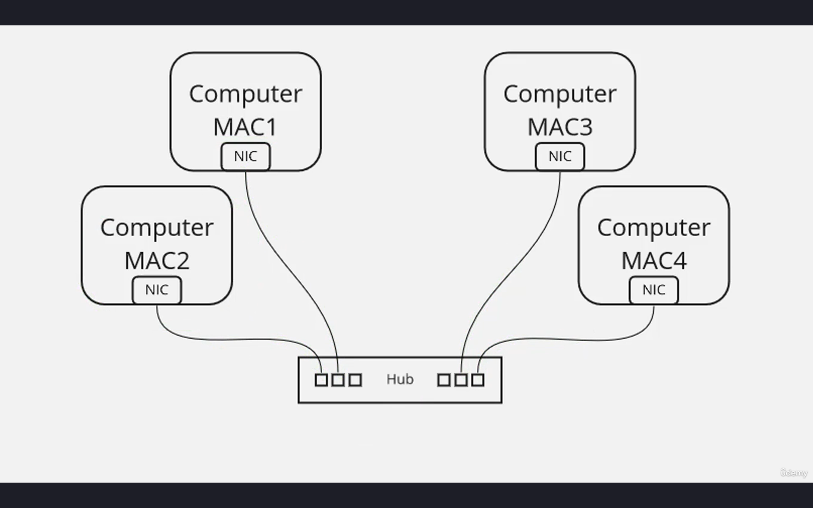
- So here you can see a diagram very similar
to what we saw in our last lesson, and we have two computers that want to communicate using a unicast.
- And so what we mean by unicast is it's simply one device trying to communicate directly with another device.
- So, in this case, let's assume that the computer with MAC address 1 wants to send some sort of data to the computer with MAC address 2.
- That's going to be a unicast.
- And so the computer with MAC address 1 will send this frame out onto the network.
- And when it arrives at the hub, well, the hub really isn't that intelligent. A hub is actually kind of dumb.
- And what it's going to do is it's going to say, "Oh, well there's something coming in here.
There's some kind of incoming traffic on the local area network. Let me just send this to everybody. Let me send it out every single port that is connected."
- And one of those ports will be connected to the destination device, and the traffic will get there.
- That's essentially how a hub works.
- It's not really the most efficient way to get traffic from one point to another.
- And that's why hubs, for the most part, are not used in modern networks.
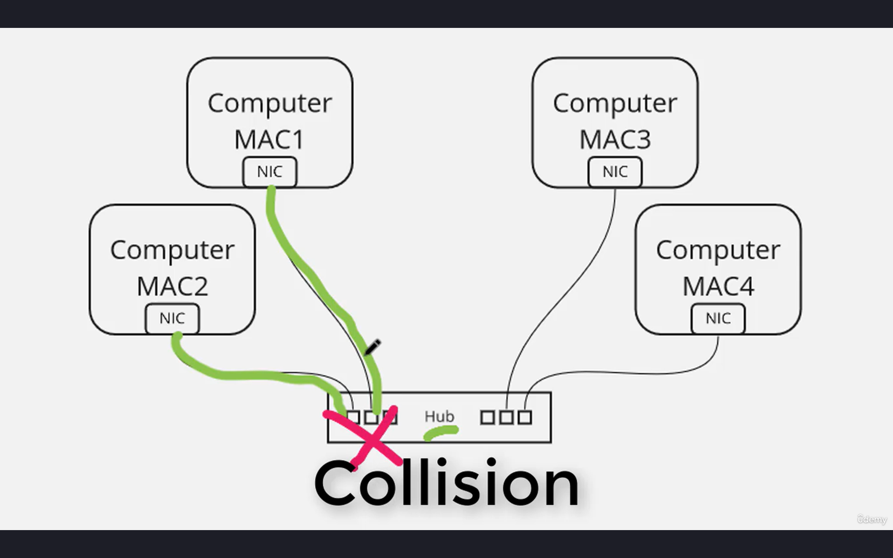
- The other negative side effect that comes with  hub is, let's assume that two computers
are trying to send traffic simultaneously.
- Well, the hub really can't handle that,
so that'll result in what we call a collision.
- And a collision is basically the hub saying, "Oh, you two are both trying to communicate at the same time? Nope. Can't do it. Try again after a random period of time." And that's what'll happen.
- Computer 1 and Computer 2 will each try to transmit again after a random time period, and hopefully they won't collide again.
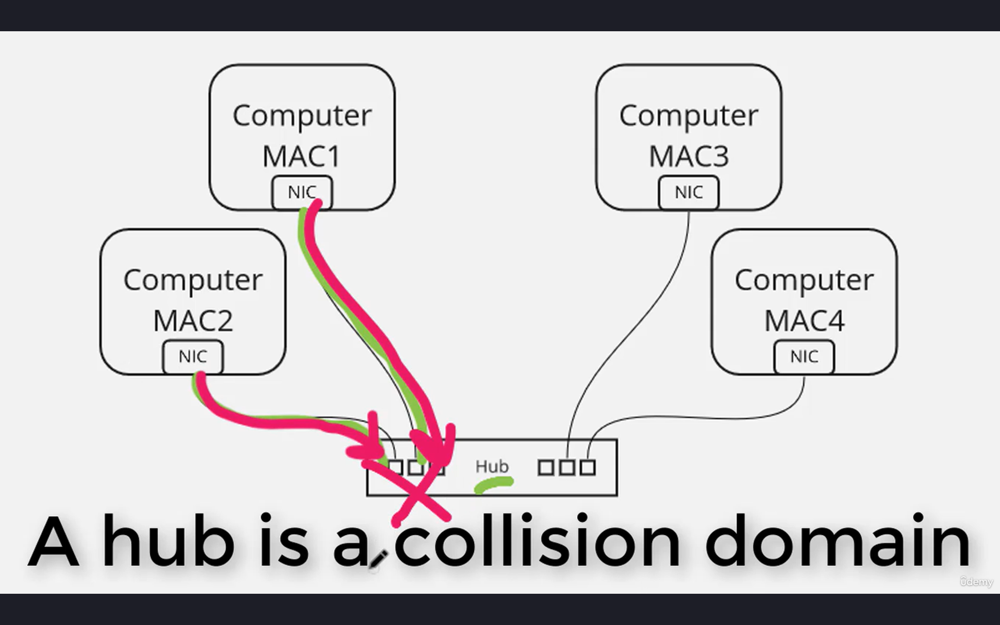
- So one of the problems with hubs is we have these collision domains. The collision domain means that every single device attached to this hub, they cannot transmit at the same time. They have to take turns.
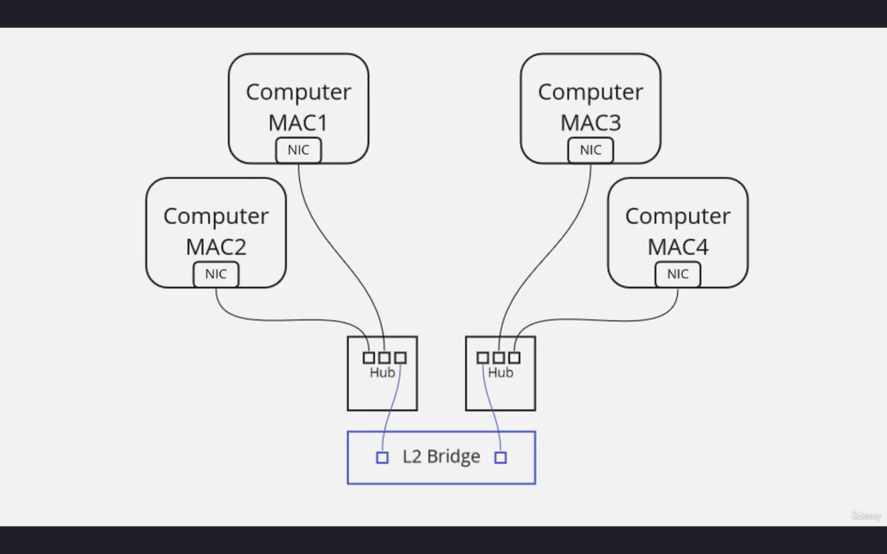
- And so, to combat this, one of the early technologies that came out and improve this situation was something called a bridge.
- So now we've altered our diagram a little bit. We actually have two hubs, and both of the hubs are connected to this Layer 2 bridge.
- And the Layer 2 bridge has a MAC address table.
- The Layer 2 bridge is more intelligent than the hub.
- And what the MAC address table does is it tracks which MAC addresses are reachable through which port.
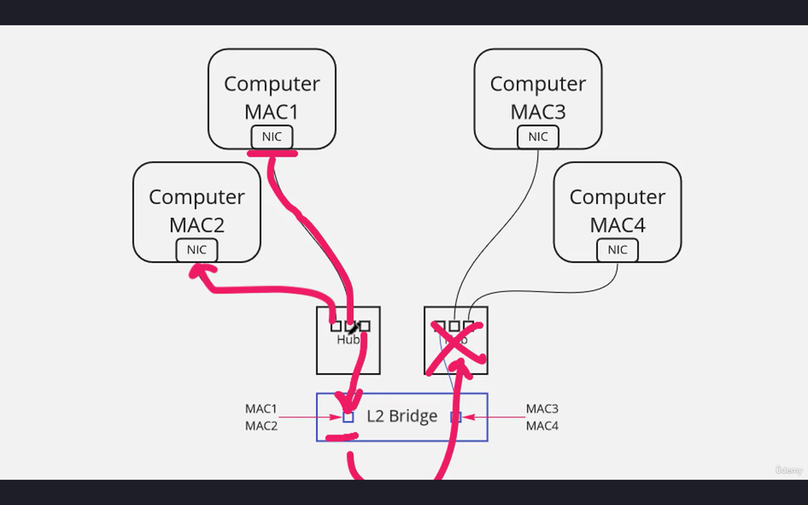
- And so the MAC address table of the Layer 2 bridge essentially knows that, in this scenario, MAC address 1 and MAC address 2 are reachable through this port, and MAC address 3 and MAC address 4 are reachable through this port.
- And so now, again, let's assume that this computer initiates a unicast that is destined for MAC2. Well, that's going to be flooded out  all of the ports on the hub.
- So it's going to be flooded to this port, but it's also going to get flooded to the Layer 2 bridge.
- And the Layer 2 bridge is going to say, "Oh, this is destined for MAC2. There's no need for me to forward this to the other hub because MAC2 exists on this particular port."
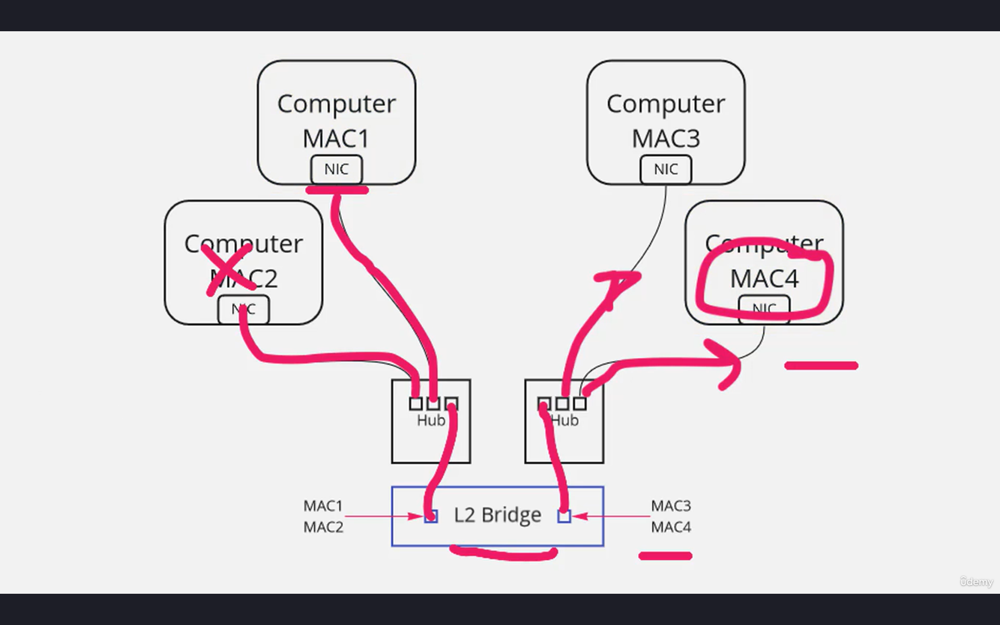
- So now we have eliminated that traffic from hitting these other computers. And if we break this down a little bit more, let's assume that Computer 1 is trying to communicate with MAC4.
- Well, now the hub is going to, again, repeat that out every port, and this computer doesn't care 'cause it's not the destination. But here it comes to the Layer 2 bridge. And the Layer 2 bridge is going to say, "Okay, MAC address 4 is on this particular port. Let's send it along."
- And the hub will repeat it out every port, and it will reach the destination MAC on the other side of the bridge. 
- So the end result is we have eliminated some unnecessary traffic from hitting some of our Machines.
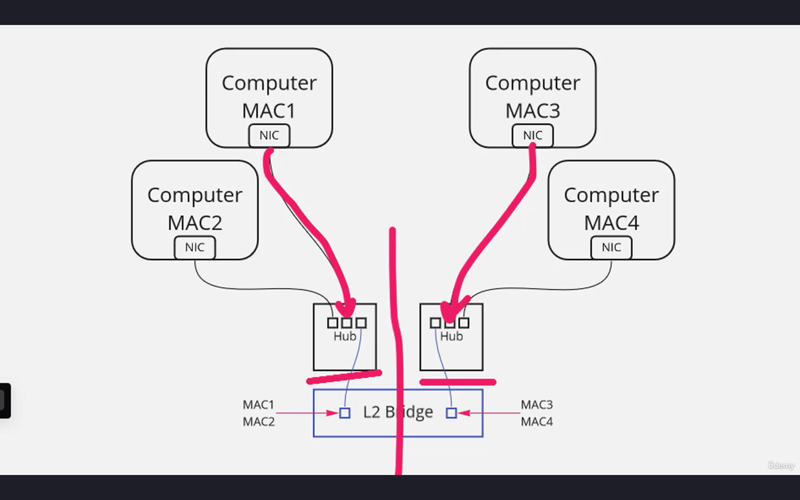
- But the other major impact is we have cut our collision domain in half. So now there's no reason that Computer 1 and Computer 3 can't transmit at the same time.
- Each hub is a collision domain, but the Layer 2 bridge essentially breaks that collision domain in half.
- So now we're going to have less collisions as well, which is also more efficient.
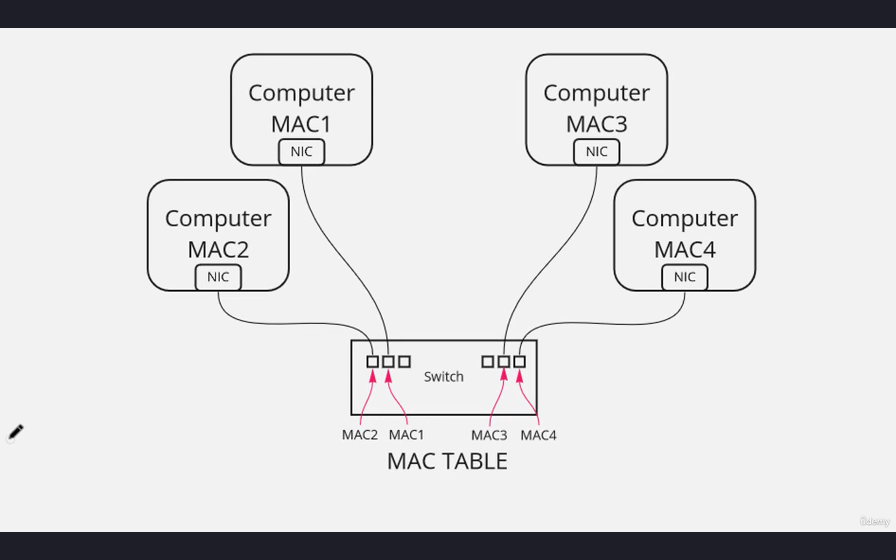
- And so the Layer 2 bridge was essentially a precursor to what we now know as a switch.
- And much like the Layer 2 bridge, the switch has a MAC table.
- And as computers are connected to the switch, the switch discovers what their MAC address is and it associates their MAC address with the port that they are connected to.
- So now we have a MAC table that contains the MAC address of every MAChine connected to the switch and which port it's connected to.
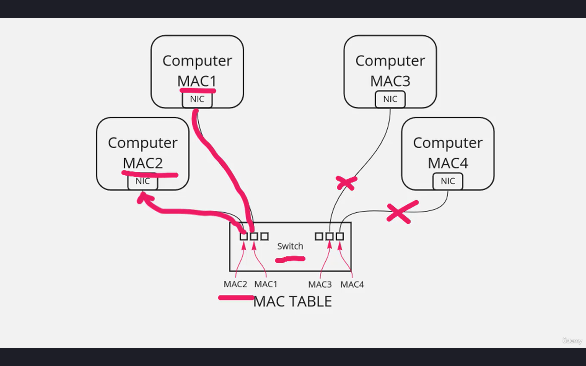
- So, again, let's assume that the first computer, MAC1, needs to send a unicast and the destination is the MAC address of Computer 2.
- Well, in comes this ethernet frame, and it hits the switch, and the switch says, "Oh, we've got an ethernet frame destined for MAC address 2. I know what port that is. Let's take that ethernet frame and forward it out
that specific port." And that traffic is not flooded to any of the other ports.
- It's a unicast, so it's one-to-one. And the only two ports that are going to actually see that frame are the ports that are connected to the source and destination machines.
- So the switch cuts down on a lot of unnecessary forwarding of traffic.

- What it also does is it creates a collision domain for every single port.
- So now all four of these computers can transmit simultaneously and it won't result in a collision, like we had with a hub.
- And so collision domains these days really aren't so much of a problem as they were back in the days of hubs. We don't really use hubs very much anymore, and that's one of the main reasons why.
- So every single port on a switch is its own collision domain.
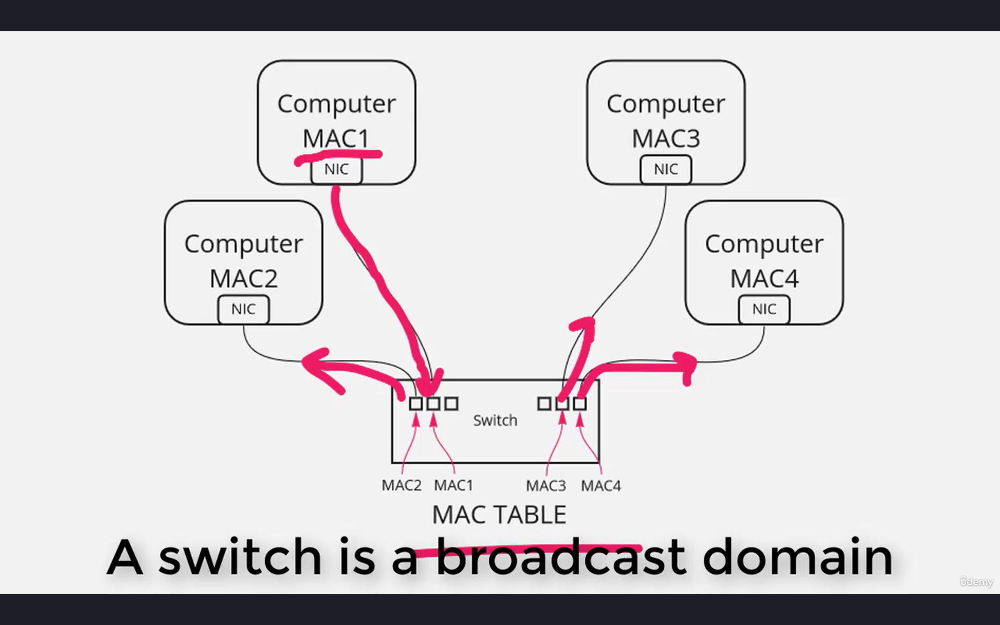
- Let's assume that Computer 1 wants to send some traffic and it wants every single machine on this switch to get a copy of that traffic. Maybe it's doing an ARP request.
- Well, there's a special MAC address called the broadcast address. 
- So, if this computer generates a broadcast, that broadcast will be flooded out every single switch port.
- And so, when we think about a switch, a switch, every single port is its own collision domain, but the entire switch is a broadcast domain unless we're separating it using VLANs.
- What we want to start to understand here is
an ethernet network typically involves a fair amount of broadcast traffic.
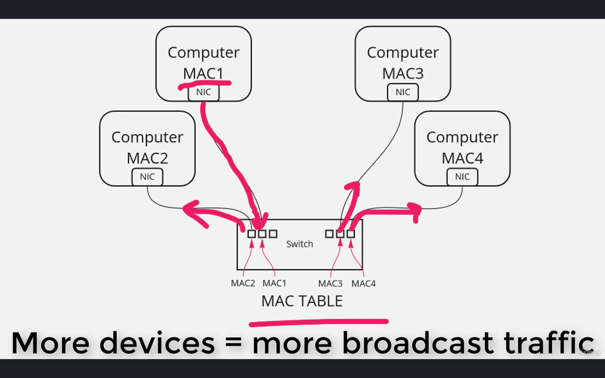
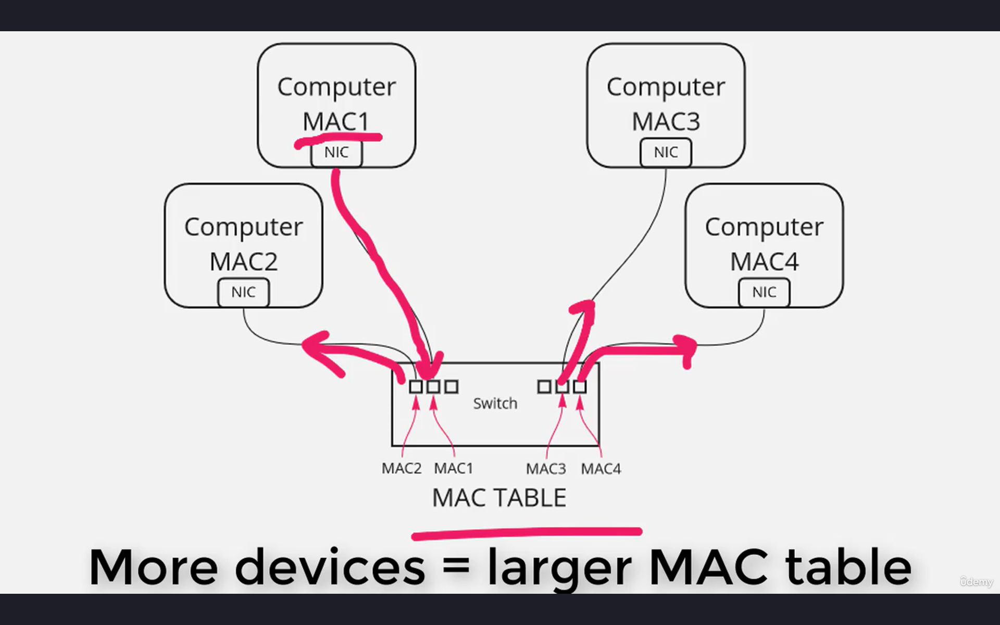
- The more devices I connect to the switch,
the more broadcasts it's going to have to take care of, and the larger its MAC address table is going to get.
- And when we start connecting switches to other switches and other switches on top of that, the size of our broadcast domain can get really large, and so can the size of our MAC address tables.
- So this kind of network, this Layer 2 ethernet segment, can only get so big. Eventually the MAC table will get too large. Eventually the number of broadcasts will exceed
what our switch can handle.
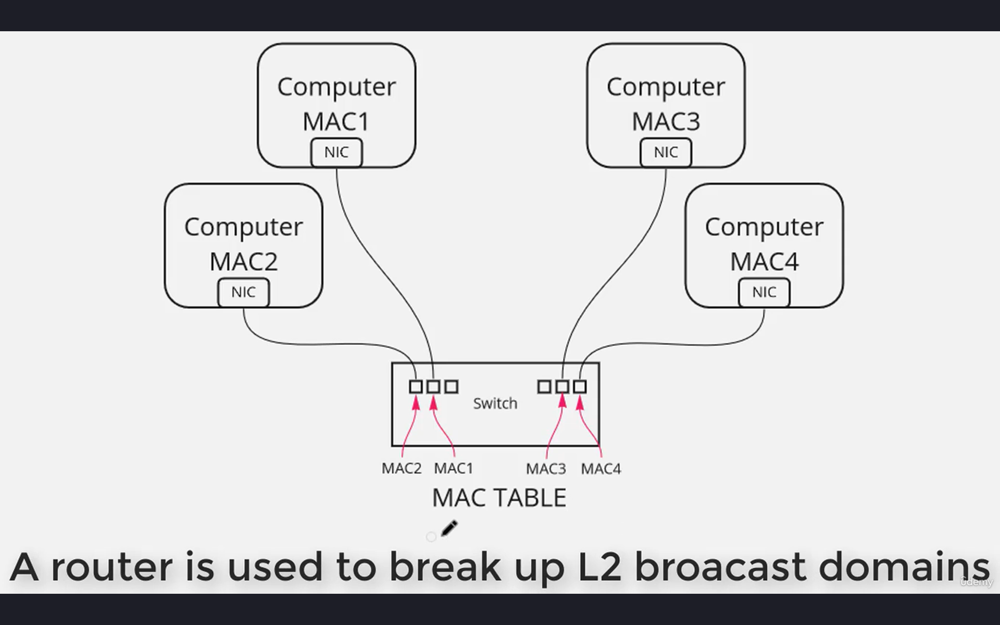
- And so, much like we wanted to cut down the size of these collision domains, eventually we may want to cut down the size of these broadcast domains. And we're going to use a router to accomplish that.
- Now, we're not going to get into that just yet, but I just want to make sure that we understand the concepts that each switch port is an individual collision domain, but that the switch itself and any other switches that it's connected to are part of the same broadcast domain.
- And any computer that generates a broadcast, those broadcasts will be flooded out
every single switch port.
- Every computer that gets connected needs an entry in the MAC address table.
# Summary

- Unicast is a one-to-one communication. It's not a broadcast, it's not a multicast. It's a unicast. It's one system communicating with one other system.
- Hubs are dumb, that they don't have MAC address tables like switches do. So when a hub receives some traffic, it's basically flooding it out every single port.
- Switches are smarter, they have MAC tables, and they can target that traffic.
- A Layer 2 segment is a broadcast domain. That means that any broadcasts generated within a Layer 2 segment are received by all systems
within that Layer 2 segment.
- If we want to reduce the amount of broadcast traffic, we can use a router to break up a broadcast domain.
