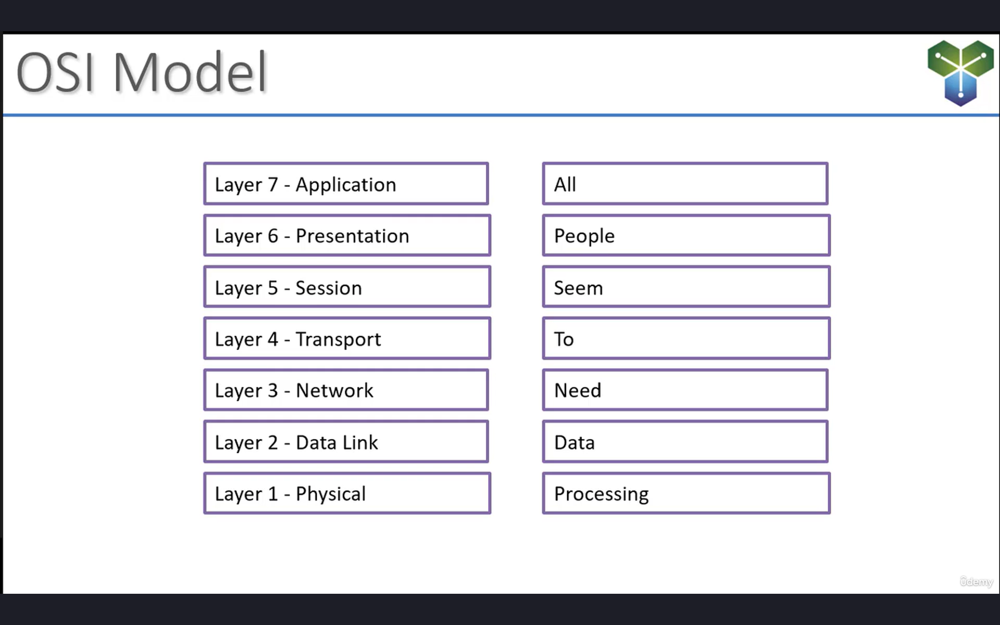
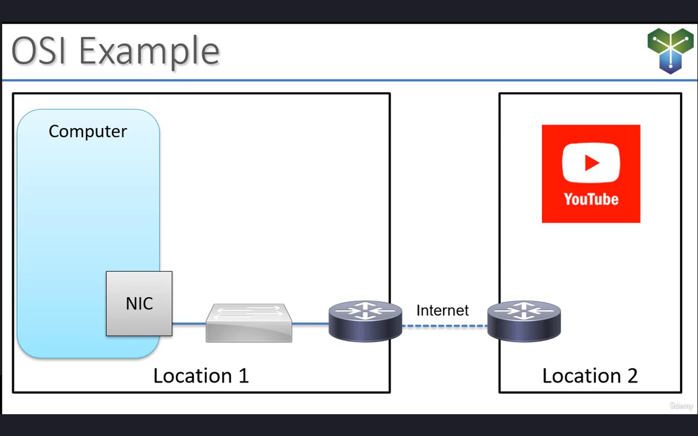
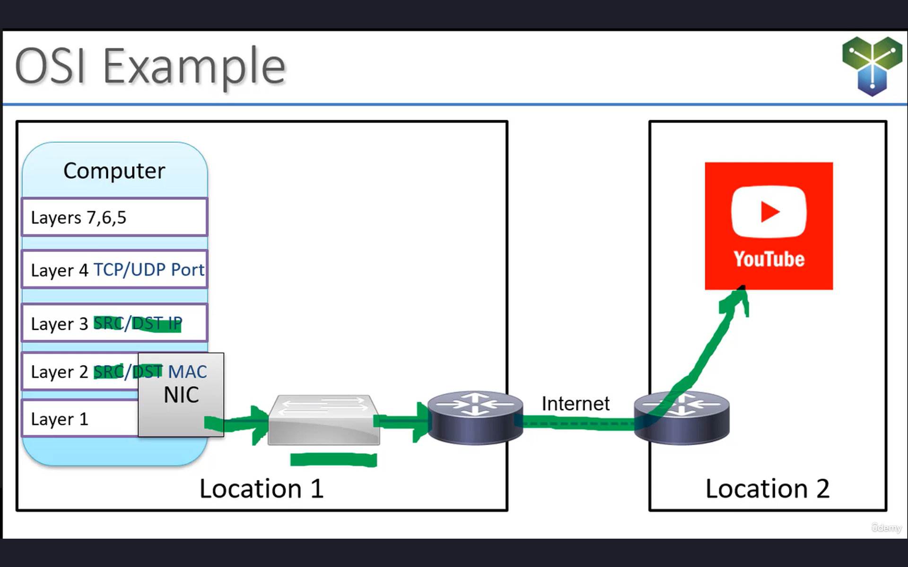
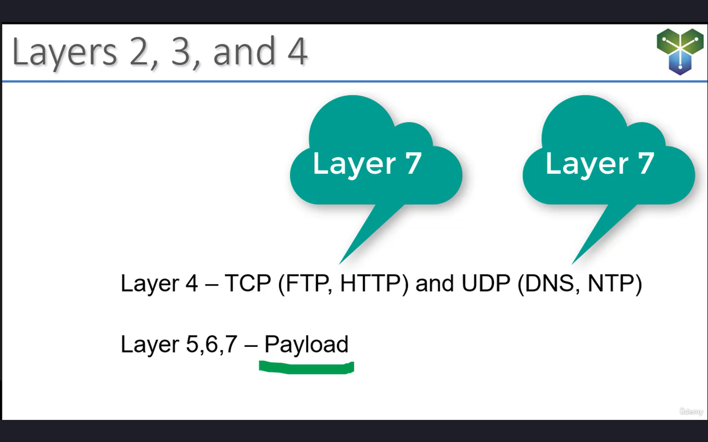
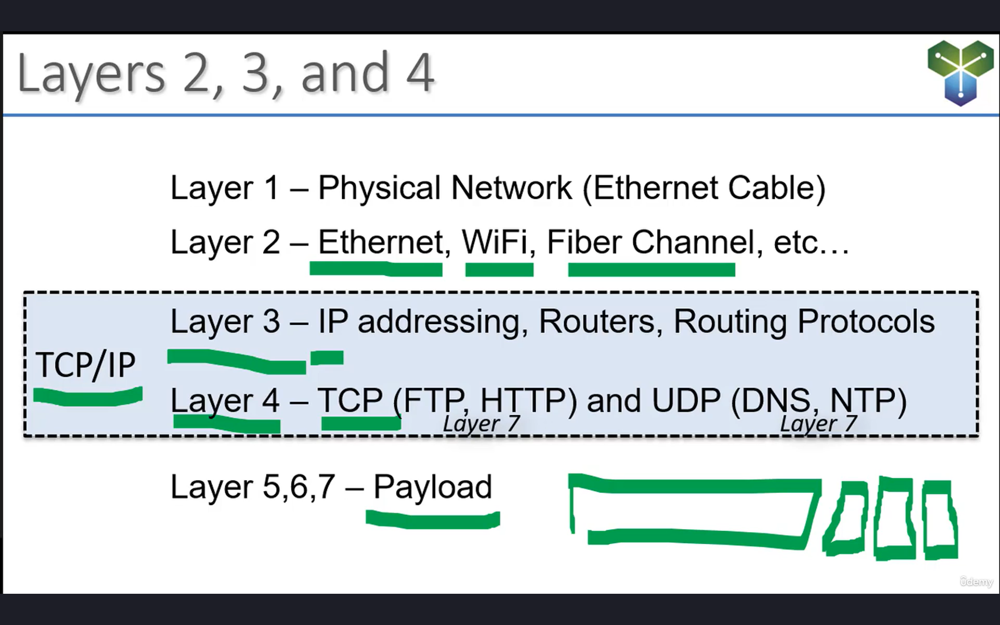
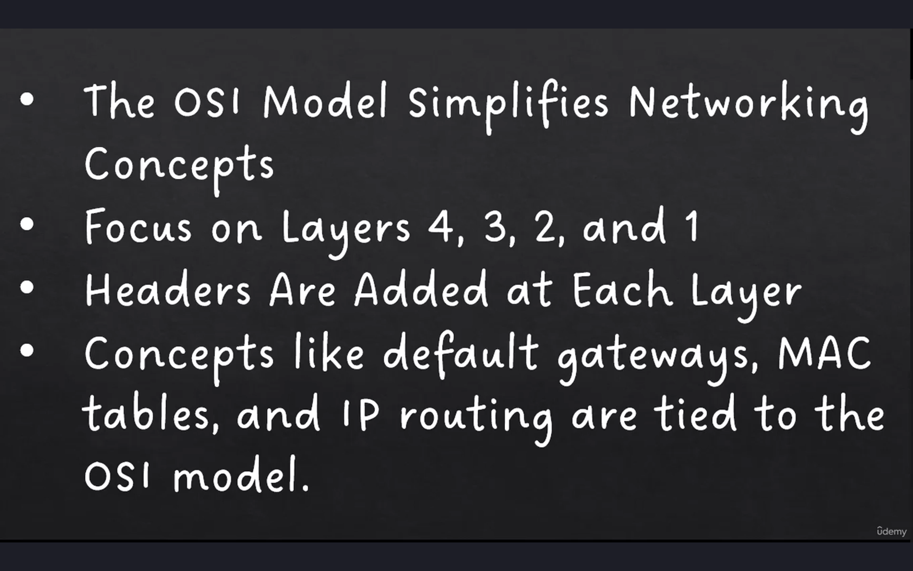

- The purpose of the OSI model is basically to help make networking easier to understand.
- Now, some of these layers are going to be more important to us than others.
- So Layers 7, 6, and 5, we're not gonna spend a lot of time talking about those in this course. That's the Application, Presentation, and Session layer.
- Layers 4, 3, 2, and 1 are much more important
from a networking perspective. 
- And so we'll start from the top down:
    - Application, 
    - Presentation, 
    - Session, 
    - Transport,
    - Network, 
    - Data Link, 
    - Physical.
- And an easy way to remember these layers
is the little mnemonic device shown here on the left, "All People Seem To Need Data Processing."
- So the first letter of each of those words
is the same as the first letter of each of the layers of the OSI model.

- Let's walk through one example of the OSI model in action.
- Let's assume that I'm on my computer
and I wanna upload a video to YouTube. Well, that's going to involve all of the seven layers of the OSI model.
- And so I'm going to create this video,
and then I'm gonna launch my web browser, and go to YouTube.
- That web browser is handling Layers 7, 6, and 5, the Application, Presentation, and Session layers.
- The layer where we really start to get concerned with as networking people is Layer 4.
- Layer 4 is going to be the transport layer. And so in this case, we're using a web browser. A web browser communicates using HTTP. Now, HTTP is a Layer 7 protocol, but it's typically associated with port 80 at Layer 4. So for HTTP, TCP is the transport layer protocol. And HTTP uses TCP port 80 for communication. And basically, Layer 4 is going to control things like how do the two systems communicate? So basically, my computer needs to communicate
with the servers at YouTube. It needs to agree upon, "Hey, are we gonna check the data that's being sent for errors? What's going to happen if some incomplete information is sent." They're gonna negotiate the parameters of this transport using Layer 4.
- But the areas that we really focus on
the most of all as a networking person,
are Layer 3 and Layer 2.
- So let's go to Layer 3, the network layer.
And so now I've got this video that's ready to go, it's sitting in my browser, and I'm about to click the Upload button. Well, that upload has to go to some destination IP address. What is the address of the system that it is going to be sent to? That's Layer 3, the IP addressing information. And so now we know, hey, this needs to go to a Layer 3 device that's available somewhere on the internet. Maybe my computer doesn't know how to get there,
but what it's going to have is something called a default gateway. It's going to have a router that it uses to send traffic to when it doesn't really know where to send it. So my computer at Layer 3 is going to say, "Oh, we're trying to upload this video, let's send it to our router. Our router will know how to get there. Let's send it to the default gateway." So now that it's determined what the next hop is, what the next step along this path is going to be,
it has to actually get the data to that router.
- And that router is connected on a local area network. So in this case, it's going to be an ethernet network, but there are other examples of Layer 2 networks. And the biggest difference between Layer 3 and Layer 2 network identifiers
is that the Layer 2 network is a local network,
and the addresses on this Layer 2 network
really only makes sense within this Layer 2 network. So the Layer 2 network is going to encompass things like the MAC address
of my network interface card, the physical switch. The network card on the router is going to have a MAC address. It's going to have these addresses that the devices use to communicate with each other over Layer 2. And so my computer is essentially thinking, "Well, I need to send this traffic to my router. The way that I get to the router is through my network interface card. And so in order to send something out my network interface card, I need a source address, that's going to be the MAC address, that's going to be Layer 2." And the switch is going to have something called a MAC table. But basically, the switch is going to know, "Hey, the router has a MAC address too.
It's going to know how to get to that router." And so at each layer, addressing information is being added.
- So at Layer 4, the addressing information
that's being added is the TCP and UDP port numbers.
- At Layer 3, the source and destination IP addresses are being added, and they're being added as headers.
- And at Layer 2, the source and destination MAC address are being added as headers as well.
- And then Layer 1 is the physical layer. So Layer 1 is the actual physical hardware. It's the network interface card connected to a cable,
and that traffic is gonna flow to the switch.

- The switch is a Layer 2 device, it is going to analyze the source and the destination MAC address. 
- The destination MAC address is my Layer 3 device, my router, which is going to analyze
the source IP and the destination IP. The destination IP is going to be these servers at YouTube, and away it goes.
- So let's talk just a little bit more about these headers.

- So we start out with Layers 5, 6, and 7 again,
and this is basically the payload. The payload is, "What am I trying to transmit?" Now, in our little example here, the payload is going to be this video that I wanna upload to YouTube. And so we start with that. The data that we actually wanna upload, that's the payload,
we're going to call that layers 5, 6, and 7.
- Once we've gotten that far, then we have to append the port numbers. So TCP and UDP are Layer 4,and I just wanna make sure I make this clear: HTTP, FTP, DNS, NTP, these are all examples of Layer 7 protocols. But I have them here because each of these protocols is going to be associated with specific ports at Layer 4.

- And so essentially what it's gonna look like
is kind of like this: We're gonna have our payload, that's the data that we actually wanna send. 
- We're to append a little header in front of it with the port number.
- We're going to append another little header in front of that with a source and destination IP that's happening at Layer 3.
- And by the way, TCP/IP, you may have heard of that acronym, that's just the combination of Layer 4 and Layer 3, TCP/IP.
- And then before we can actually go out on the physical network, we have to append one more header. This is the Layer 2 header. In this case with an ethernet network, we're talking about the source and destination MAC address.
- But there's all sorts of Layer 2 networks
that we're not really going to talk about here,
like WiFi or fiber channel.
- Once all of those headers are appended, then it can actually be transmitted onto the physical network.
# Summary

- The purpose of the OSI model is to simplify networking concepts.
- Now, as network administrators and network engineers, we are going to focus on Layers 4, 3, 2, and 1 of the OSI model.
- And we saw that as traffic traverses a network, there are going to be headers added at each layer. So for example, at Layer 2,
we're going to have source and destination MAC addresses.
- At Layer 3, we're going to have source and destination IP addresses.
- And at Layer 4, we're going to have TCP and UDP ports.
- And by understanding the OSI model, this will give us a foundation and a basis to understand more complex concepts like what is a default gateway or a MAC table or a router.