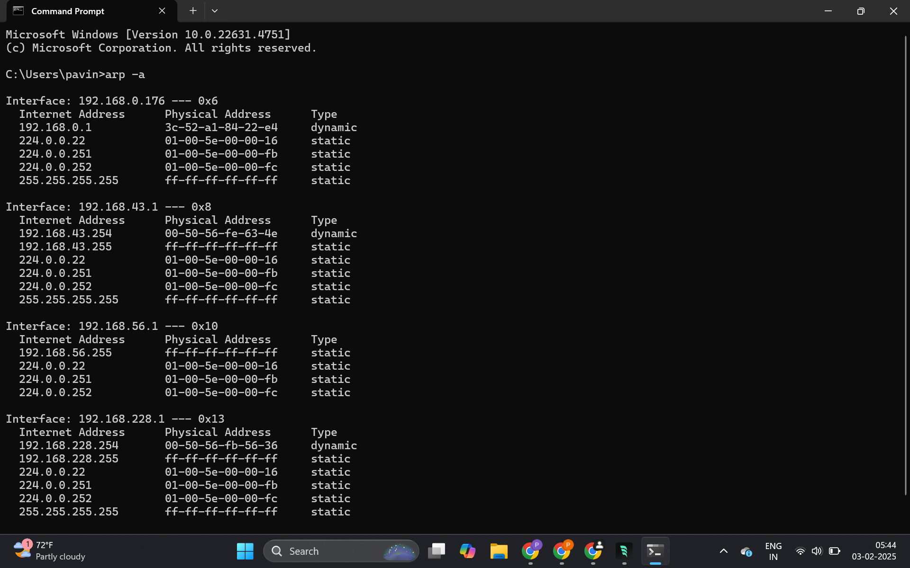

- Bum stands for broadcast, unknown, unicast and multicast.
# Broadcast:
- Let's take our previous example.
- We see our four computers connected to our Ethernet switch.
- The switch knows about all of the Mac addresses of those computers. That's got its Mac table.
- And let's again say that computer1 wants to communicate with computer2. Well, the Mac address isn't the only address involved in this communication.
- Each computer has an IP address. An IP address is an address that we allocate and that we assign to these individual computers. So it's not like a mac address.
- A mac address is hard coded and associated with the physical network interface, the network interface card.
- An IP address is something that we control and that we assign to these machines.
- I almost think of an IP address as like a phone number. It's unique. There are no two computers on this network with the same IP address. And if you think about phone numbers, if two people had the same phone number, well, when you dial that phone number, who would get that call? It doesn't work and we can't have IP address conflicts either.
- So if we want our network to work, every single computer needs a unique IP address. And that's the address that computer programs use to talk to each other.
- So for example, let's say that computer one needs to send a file. It's trying to transmit a file and establish a connection to computer two. So computer two is going to be the destination.
- Well in order to establish that connection computer one needs to know the IP address of computer two. And let's just assume that it does.
- So let's assume that computer one knows the destination IP, but it does not know the destination Mac. Well, in that case we have a problem because computers in a local area network communicate using Mac
addresses.
- They have to know each other's Mac address in order to communicate.
- And so the result of this is going to be computer one is going to generate a request. It's going to send out what we call an ARP request to the switch. 
- And the ARP request is a broadcast.
- And so an ARP request is generated by the source computer.
- And it is a layer two Ethernet broadcast used to discover the Mac address associated with a particular
IP.
- So essentially computer one is sending out a layer two broadcast which hits the switch, and the layer
two broadcast basically says something like this.
- And because it's a broadcast, it is flooded out every single port on the switch. 
- And so computer three receives it and it sees this ARP request and it says, well, somebody is looking
for the owner of IP address two. And that's not me.
- Same thing with computer four says I do not own IP too, but it's also repeated out this port as well.
- And this computer says, oh, somebody is looking for IP address two. That's me. Let me send an ARP response to the requester.
- And so that ARP response is then received by computer one and computer one can now update the internal
ARP table for computer one. And so the ARP table of the computer.
- The ARP table is basically a table full of these associations.
- And so now that it's discovered the destination Mac address that it needs, it can send out a layer two unicast, which will hit the switch destined for Mac two.
- And the switch will look at its Mac table and it'll say, oh, for Mac two, I forwarded out this port. And now the two devices can communicate.
- That's an example of a broadcast.
- So on my computer, I can go to the command prompt and I can type in ARP space dash a.
- And it will display the ARP table for my computer.

- And you can see here, basically all it's doing is it's showing me IP addresses and the Mac addresses associated with them.

- So each device on my network has a Mac address associated with every single physical adapter and they also each have an IP address.
- So a layer two broadcast is basically any Ethernet frame that is sent to the switch that is sent to a specific address called the broadcast address. And that broadcast address informs the switch that it needs to be flooded out.
- Every single port that's a broadcast and an ARP request is a great example of a broadcast.
# Unknown Unicast:
- So here you can see I now have two switches. And two computers are connected to one switch, two computers are connected to the other switch, and in the middle I have what we call an inter switch link.
- You can do this with switches. Sometimes it's called daisy chaining, but basically you can connect to multiple switches together and have them act like one big switch.
- And so in this case, it's possible that, let's say computer one sends an Ethernet frame that is destined for Mac address three.
- And the Ethernet frame arrives at this switch. And this switch says Mac address three. I don't know about that one. I don't have it in my Mac table. I don't know where to send it.
- This is what we call an unknown unicast, where the Switchport doesn't know which port a mac address is on.
- The switch will respond by saying, I don't know where Mach three is. Let me flood this out every single port. Including sending it to the other switch.
- And so what the switch is attempting to do here is to discover which port is Mac address three reachable through.
- And when a response comes back, here comes the response from this computer. And the response eventually arrives at this switch.
- The switch will say, oh, okay, I see Mac three. I see the return traffic coming through a certain port.
- I will update my Mac address table to now reflect that that Mac is reachable through that port.
- That's what we call an unknown unicast.
- And that's how a switch discovers which computers are connected to which port.
- And essentially the unknown unicast is resulting in basically a broadcast.
- So this is one of those special types of traffic where there's one source, but the resulting traffic is delivered out many ports.
# Multicast:
- And so what all these different types of bum traffic have in common as they are multi-destination, a frame is generated and it's delivered to multiple destinations.
- And multicast is just another example of that type of multi-destination traffic, where basically let's say the computer one is generating some traffic that needs to be received by computers four and two, but not computer three. Well, that's a multicast.
- So the traffic is sent to a certain address that belongs to a multicast group that exists in the switch. And the switch knows which ports are members of this particular group.
- And based on that, it will forward that traffic out thse particular ports, but it will not forward it out anyother ports that are not part of that group.
- There are specific members and the source frame only has to be generated once it hits the switch, and the switch handles, forwarding it to all the members.
# Summary:
- Each machine is going to have a unique IP address. The IP address we think of as a layer three network address.
- So every machine connected to a network will have a unique IP address.
- ARP requests are layer two broadcasts. And any time a broadcast is sent out on a layer two Ethernet segment, it will be received by every single machine on that layer two Ethernet segment.
- So an ARP request is a broadcast, and an ARP request specifically is an attempt to learn the destination Mac of some other machine.
- We then have an unknown unicast, so we can connect multiple switches to one another and create a large layer two network.
- If one of these switches doesn't know how to get traffic to a certain Mac address, it will issue an unknown unicast, which will generate a broadcast out every port on that layer two segment. To find that destination Mac and map it to a certain port.
- And then finally we have multicast traffic, our third type of multi-destination traffic, where a single source is sending some sort of traffic out to a specified group of recipients.
- These three types of multi-destination traffic make up Bumm traffic broadcast, unknown, unicast and multicast.